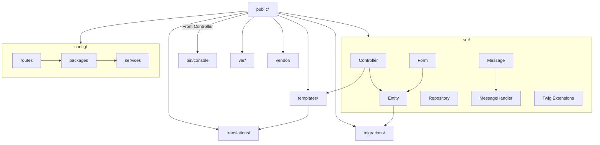
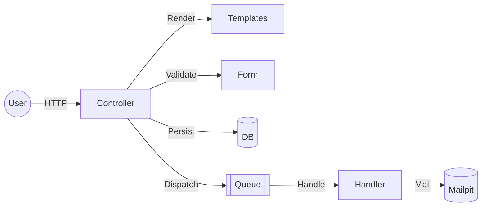

# Event Registration Demo — PHP/Symfony

This small web app demonstrates core backend engineering concepts in PHP using Symfony. You’ll see clean routing/controllers, forms + validation, persistence with Doctrine, async processing with Messenger, secure defaults, and a production-like local setup with Docker/DDEV — explained didactically for recruiters.

---

## 🎯 Goals
- Model a simple registration domain with a `Registration` entity persisted via Doctrine. 
- Implement forms, validation, CSRF protection, and friendly error messages. 
- Demonstrate async processing with Symfony Messenger (e.g., sending confirmation emails). 
- Showcase secure headers and hardening via NelmioSecurityBundle. 
- Provide a smooth DX: reproducible environment, code style, refactoring, and tests.

---

## 📦 Tech Stack & Tools

Badges:
- 
- 
- 
- 
- 

Details:
- Language/Runtime: PHP >= 8.2
- Framework: Symfony 7.3 (FrameworkBundle, Form, Validator, Security, Messenger, Mailer, Twig, Translation, HTTP Client, Console, Asset/Mapper, WebLink)
- Persistence: Doctrine ORM 3.x, Doctrine Migrations, Doctrine DBAL 3
- Async: Symfony Messenger (Doctrine transport in local dev)
- Templates/UI: Twig
- Security: Security Bundle + NelmioSecurityBundle
- Quality: PHPUnit 12, PHP-CS-Fixer, Rector, PHPStan/PHPDoc parser
- Dev: Monolog, Web Profiler, Debug, Docker + DDEV

---

## 🧠 Key Concepts in This Codebase

1) HTTP and MVC-ish layering
- Controllers in `src/Controller` map routes to actions and render Twig templates. 
- Forms and validation via `src/Form` and Symfony Validator. 

2) Persistence
- Domain modeled with Doctrine entities under `src/Entity` and repositories in `src/Repository`.
- Migrations via Doctrine Migrations.

3) Asynchronous processing
- Symfony Messenger handles background jobs (e.g., email confirmation) using Doctrine transport in dev.

4) Security and hardening
- CSRF protection on forms and secure HTTP headers with Nelmio.

5) Internationalization
- Translations managed in `translations/` and used in Twig templates.

---

## 📁 Project Structure


Optional high-level component view:


---

## ▶️ How to Run (Local with DDEV)
1. Prerequisites
   - Docker
   - DDEV (Symfony quickstart)
2. Bootstrap
   - Copy `.env` to `.env.local` and set local overrides (see below)
   - Start: `ddev start`
   - Launch: `ddev launch`
   - Run messenger worker (separate terminal):
     `ddev exec -s web php bin/console messenger:consume async -vv`
   - Stop: `ddev stop`
3. Database migrations
   ```shell
   ddev php bin/console doctrine:migrations:migrate -n
   ```
4. Useful endpoints
   - App: https://app.ddev.site
   - Mailer inbox (Mailpit): https://app.ddev.site:8026/

---

## 🔧 Environment (.env.local examples)
```
MAIL_FROM_ADDRESS=no-reply@app.ddev.site
MAILER_DSN="smtp://127.0.0.1:1025"
MESSENGER_TRANSPORT_DSN="doctrine://default"
APP_URL="https://app.ddev.site"
```

---

## 🧪 Testing & Developer Experience
- Code style (PHP-CS-Fixer):
  ```shell
  ddev exec -s web ./vendor/bin/php-cs-fixer fix src
  ```
- Automated refactoring (Rector):
  ```shell
  ddev exec -s web ./vendor/bin/rector process
  ```
- Clear cache:
  ```shell
  ddev php bin/console cache:clear
  ```
- PHPUnit tests:
  ```shell
  ddev exec -s web ./vendor/bin/phpunit
  ```

---

## 🗄️ Database (local defaults)
- host: 127.0.0.1
- port: 33066
- user: root
- password: root

---

## 🔒 Security & Best Practices
- CSRF protection on forms
- Secure headers and XSS protections (NelmioSecurityBundle)
- Validation on all inputs using Symfony Validator
- Environment-specific configs and secrets; sensitive values not committed

---

## 🌐 Internationalization (i18n)
- Codebase in English; translations directory prepared for additional locales
- Twig templates structured for message extraction and translation

---

## 🧾 License
[MIT](https://choosealicense.com/licenses/mit/)
